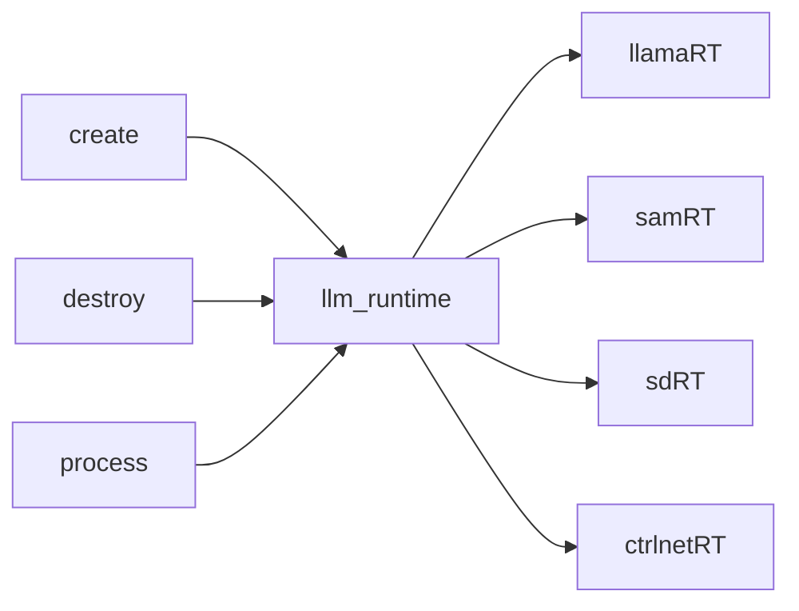

# :running: WIP

## Introduction

[中文文档](README.zh.md)
llm-runtime encapsulates the runtime of various models and provides a simple abstract interface for easy deployment.

## Diagram

## Support plan

- [ ] LLama
- [ ] SAM(meta)
- [ ] Stable Diffusion
- [ ] Control Net
