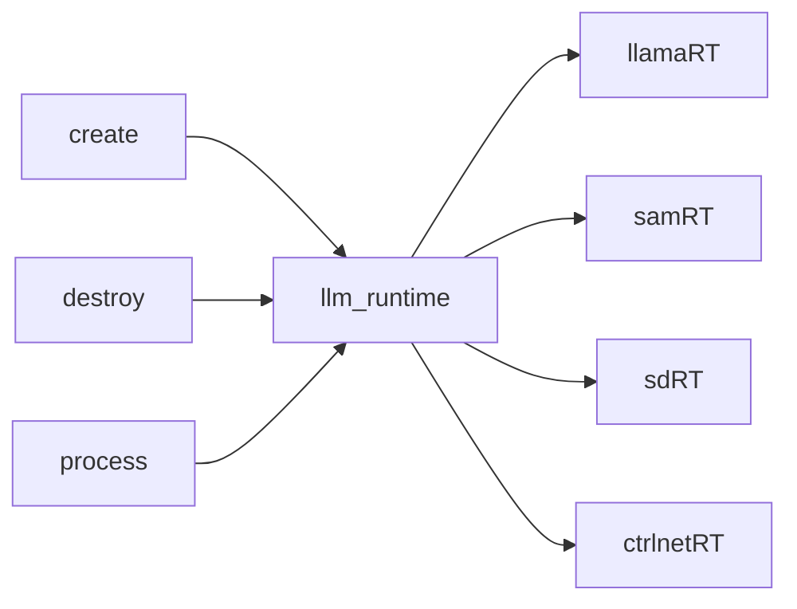

# :running: WIP

## 介绍
llm-runtime 封装了多种模型的运行时，提供简单的抽象接口以方便简单部署

## 框图

```mermaid
graph LR

create-->llm_runtime
destroy-->llm_runtime
process-->llm_runtime
llm_runtime-->llamaRT
llm_runtime-->samRT
llm_runtime-->sdRT
llm_runtime-->ctrlnetRT
```

## 支持计划

- [ ] LLama
- [ ] SAM(meta)
- [ ] Stable Diffusion
- [ ] Control Net
